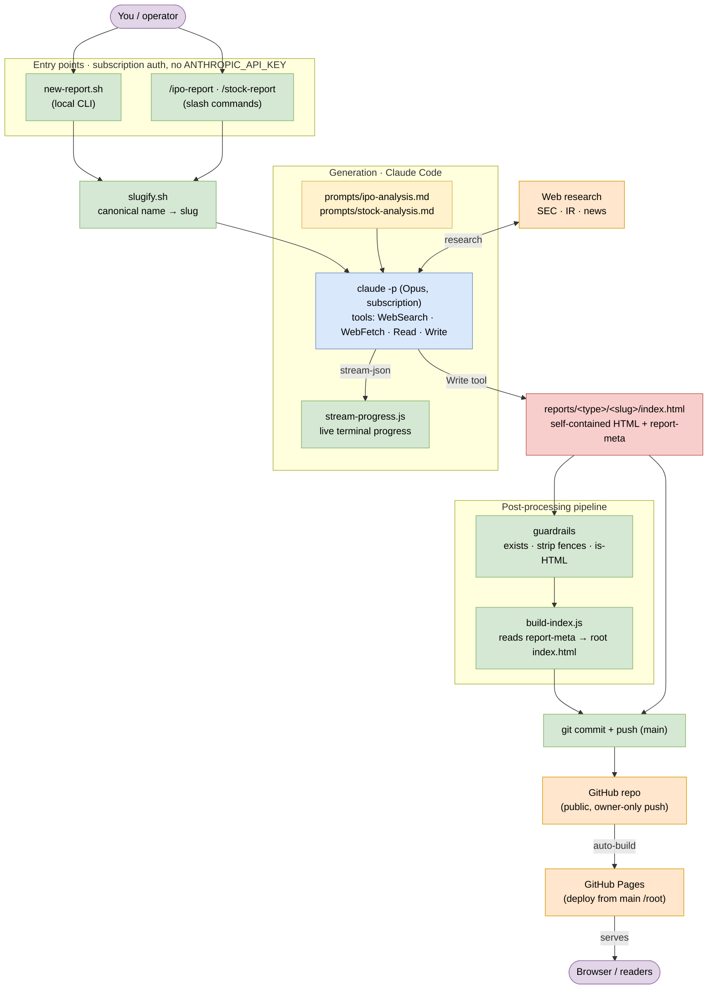

# Architecture

A **static, file-based, education-only** report pipeline. No backend, no database, no CI —
just the Claude Code CLI, Node built-ins, files in the repo, and GitHub Pages.

The editable source diagram is [`architecture.drawio`](architecture.drawio) (open at
[app.diagrams.net](https://app.diagrams.net) or with the VS Code "Draw.io Integration"
extension). The Mermaid version below renders inline on GitHub.

## Layers

| Layer | Components | Role |
|-------|-----------|------|
| **Entry points** | `new-report.sh`, `/ipo-report` & `/stock-report` | Request a report; both run on the Claude Code subscription (never an API key). |
| **Shared** | `slugify.sh` | The single canonical `name → slug` transform, so a company always maps to one path. |
| **Generation** | `claude -p`, `prompts/*.md`, web tools, `stream-progress.js` | Research live data and write a self-contained HTML report via the Write tool; stream progress to the terminal. |
| **Output** | `reports/<type>/<slug>/index.html` | One self-contained report per company, carrying a `<!-- report-meta -->` provenance comment. |
| **Post-processing** | guardrails, `build-index.js` | Verify the file, then regenerate the root `index.html` by reading every report's `report-meta`. |
| **Publish** | `git push` → GitHub → Pages | Commit to `main`; GitHub Pages serves the static site to browsers. |

## Design decisions

- **Static only.** Single-user, batch-style ("name in, report out") — a repo + an agentic
  runner is the right amount of machinery; a web service would only be justified if this went
  multi-user or needed an always-on endpoint.
- **Subscription auth, no CI.** Reports run via `claude -p` on the logged-in plan. An
  unattended CI runner can't use that login and would need a paid API key, so there is
  intentionally no GitHub Action.
- **One slug source of truth.** `slugify.sh` is called by every entry point so paths can't
  diverge.
- **Provenance as data.** The `report-meta` comment makes each report self-describing, so
  `build-index.js` can title, group, and date-sort the landing page deterministically.

*Educational only — not financial advice.*
